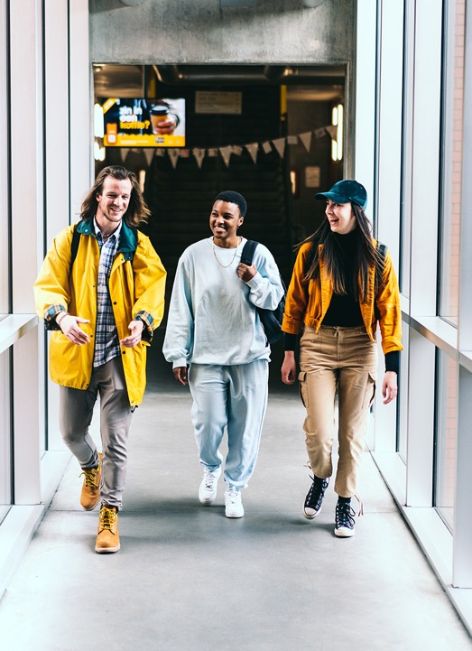

<!--
  Starter deck for the tm theme — shows every custom layout and the three
  colorways.
-->

# Webdesign in de praktijk

Van schets tot werkende site

---
layout: toc
hideInToc: true
---

# Inhoud

---
layout: section
color: navy
number: "01"
eyebrow: Eerste deel
---

# Fundamenten

HTML als skelet, CSS als huisstijl.

---
level: 2
---

# Drie gewoontes van goede markup

Begin bij de structuur, niet bij de opmaak.

- **Semantiek eerst.** Kies het element op basis van betekenis, niet van uiterlijk.
  - `<nav>` voor navigatie, `<article>` voor een zelfstandig stuk inhoud
  - een `<div>` is pas de laatste optie
    - ook voor een [screenreader](https://developer.mozilla.org/) telt dit
- **Valideer vroeg.** Eén vergeten sluittag kost je een namiddag.

---
level: 2
---

Voorbeeld {.eyebrow}

# Eén component, één taak

```ts
// Bereken de leesbaarheidsscore van een tekst
export function readability(text: string): number {
  const words = text.split(/\s+/).length;
  const sentences = text.split(/[.!?]+/).length;
  return 206.835 - 1.015 * (words / sentences);
}
```

---
layout: two-cols-tm
level: 2
---

# Twee manieren om te reviseren

::left::

Top-down {.eyebrow.teal}

Vertrek van de structuur. Controleer of elke sectie haar plaats verdient
voor je één selector begint te verfijnen.

::right::

Bottom-up {.eyebrow}

Vertrek van de details. Schrap dode regels CSS en laat de structuur
zichzelf tonen terwijl de stylesheet leaner wordt.

---
layout: quote
author: Piet Pienter
---

Deze slide is perfect voor citaten of andere korte teksten.

---
layout: cover
color: orange
eyebrow: Colorway demo
presenter: Lars De Richter
affiliation: Thomas More
hideInToc: true
---

# Dezelfde cover, in het oranje

Elke layout aanvaardt `color: white | orange | navy`

---
layout: section
color: orange
number: "02"
eyebrow: Tweede deel
---

# Kleur als structuur

De drie colorways komen rechtstreeks uit het PowerPoint-sjabloon.

---
color: navy
level: 2
---

# Inhoud op een donkere achtergrond

Ook gewone contentslides kunnen een colorway krijgen.

- De bullets wisselen mee van kleur
  - net als links en de footer
- Gebruik dit spaarzaam: wit is de standaard voor inhoud

---
layout: image-side
image: /demo.jpg
eyebrow: Figuur 1
caption: De foto vult de helft van de slide, van rand tot rand.
credit: Foto · TM-sjabloon
level: 2
---

## Beeld naast tekst

De foto kadert automatisch (`cover`); de tekstkolom centreert zichzelf.

---
layout: image-side
image: /demo.jpg
side: left
fit: contain
eyebrow: Figuur 2
caption: Volledig getoond, zonder bijsnijden.
level: 2
---

## Wanneer bijsnijden zou liegen

`fit: contain` toont het volledige beeld in het paneel. Gebruik het voor
screenshots, diagrammen en alles met randen die betekenis dragen.

---
layout: image-full
image: /demo.jpg
eyebrow: Figuur 3
caption: Het bijschrift ligt op een vlak kleurblok met een oranje accent.
credit: Foto · TM-sjabloon
level: 2
---

### Een slidevullend beeld

---
level: 2
---

Figuur 4 {.eyebrow}

# Een beeld in de tekstflow

Een Markdown-afbeelding op haar eigen regel wordt gecentreerd en krijgt een
vlak paneel. Let op het pad: Markdown-afbeeldingen zijn **relatief**, niet
`/demo.jpg`.

{.max-h-40}

---
level: 2
---

# Tabellen en accentkleuren

| Opleiding    | 2024 | 2025 |
| ------------ | ---- | ---- |
| Programmeren | 210  | 245  |
| Webdesign    | 138  | 152  |

De accentkleuren uit het sjabloon: [teal]{.teal}, [groen]{.green} en
[navy]{.navy} kleuren ook tekst; amber, cyan en lime zijn te licht voor tekst
en dienen voor grafieken. Oranje hou je voor titels.

---
layout: end
color: navy
contact: |
  Lars De Richter
  lars.derichter@thomasmore.be
hideInToc: true
---

# Bedankt!
